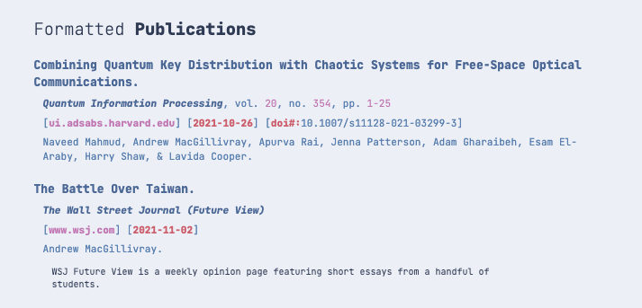

# Baltic
[](https://badge.fury.io/rb/baltic)

Baltic is a Jekyll theme inspired by the popular Nord color theme. 

## Features




## Example Site


## Installation

Add this line to your Jekyll site's `Gemfile`:

```ruby
gem "baltic"
```

And add this line to your Jekyll site's `_config.yml`:

```yaml
theme: baltic
```

And then execute:

    $ bundle

Or install it yourself as:

    $ gem install baltic
